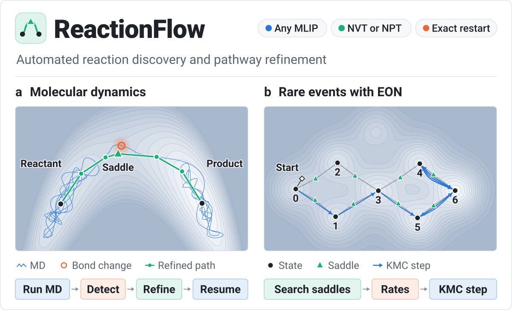
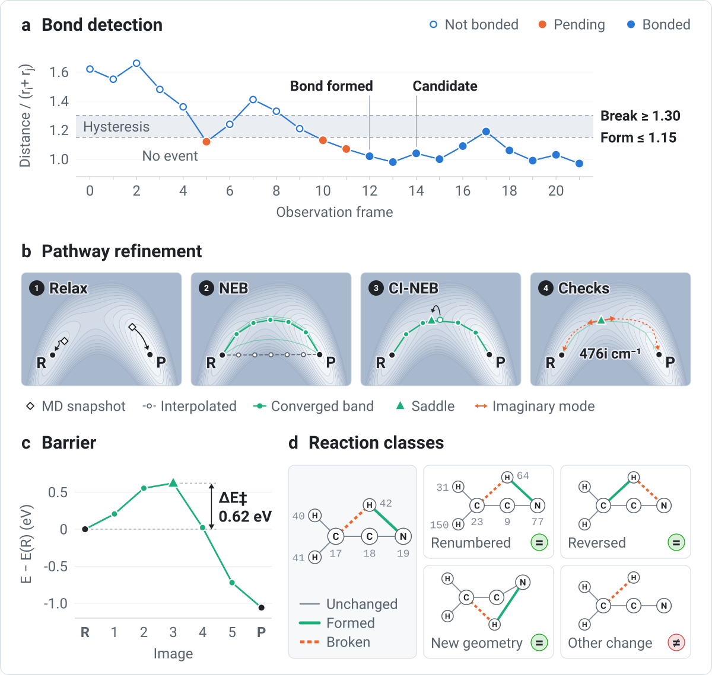
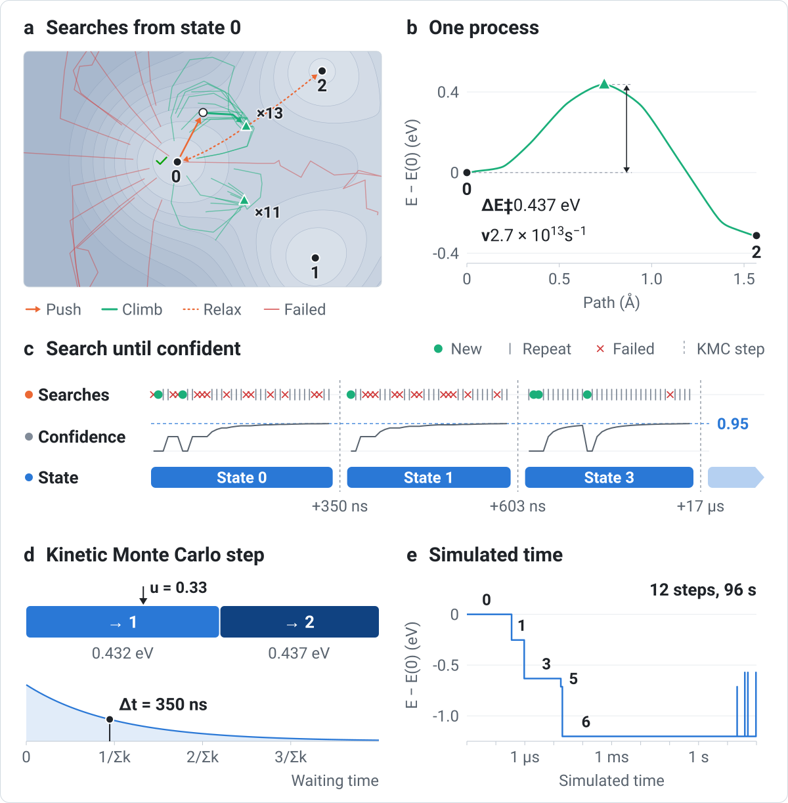
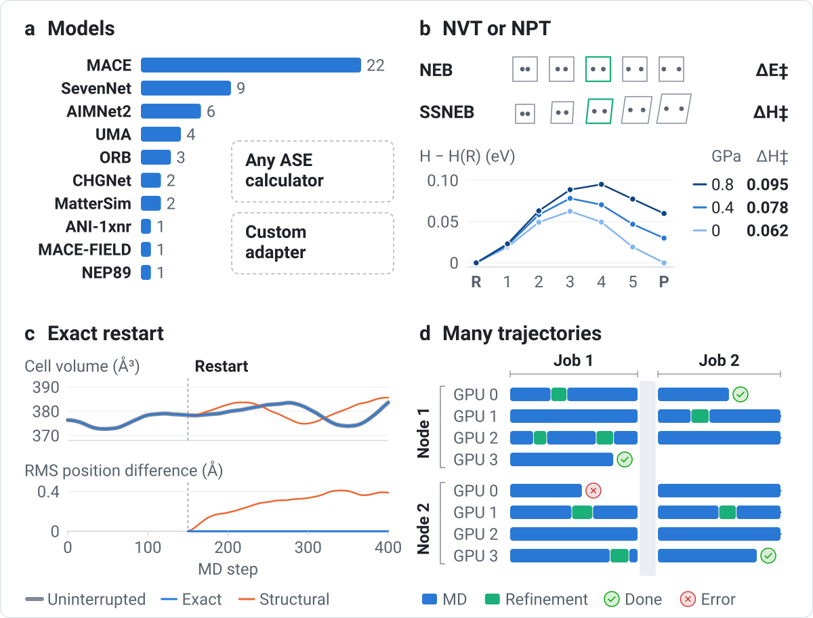

<picture>
  <source media="(prefers-color-scheme: dark)" srcset="docs/figures/overview-dark.svg">
  
</picture>

ReactionFlow finds reactions in molecular dynamics and computes their pathways. It watches the
bonds while a trajectory runs. When a bond forms or breaks and stays that way, the trajectory
pauses at an exact checkpoint, ReactionFlow refines the minimum-energy path of that change with
NEB and climbing-image NEB, and the trajectory continues from the same state. The dynamics and the
refinement use the same machine-learned interatomic potential (MLIP), which can come from any of
ten built-in model families or from any ASE calculator.

For reactions too rare to see in MD, ReactionFlow can run adaptive kinetic Monte Carlo with EON
instead. EON finds the saddles that lead out of each state, and ReactionFlow moves from state to
state by their harmonic transition-state rates, using the same models as MD.

## Install

```bash
git clone https://github.com/Austin243/ReactionFlow.git
cd ReactionFlow
python -m pip install .
```

ReactionFlow needs Python 3.12 or newer. The core package depends only on ASE, NumPy, and
NetworkX. Model backends are installed separately. `reactionflow prepare campaign.json --install`
installs the ones a campaign uses, or you can install an extra yourself, for example
`python -m pip install '.[mace]'`. Several backends pin conflicting versions of e3nn, Torch, or
other packages and need separate environments ([which ones](docs/models.md#install-and-prepare)).

## Run a campaign

A campaign is one JSON file with the starting structure, the models to use, and a list of
trajectories. `reactionflow init` writes it for you after asking about the structures, models,
temperatures, pressures, and number of runs. A one-trajectory campaign written by hand looks like
this.

```json
{
  "schema_version": 2,
  "structure": "structure.extxyz",
  "output_root": "runs",
  "require_gpu": true,
  "adapter_profiles": {
    "mace-omol": {
      "factory": "reactionflow.adapters.mace:create_adapter",
      "options": {"family": "mp", "model": "mh-1", "head": "omol", "device": "cuda"}
    }
  },
  "reaction_run": {"observation_interval": 10},
  "trajectories": [
    {
      "id": "300K-seed1",
      "adapter_profile": "mace-omol",
      "total_steps": 100000,
      "timestep_fs": 0.5,
      "temperature_K": 300.0,
      "pressure_GPa": null,
      "seed": 1
    }
  ]
}
```

Paths are relative to the campaign file, and a trajectory can name its own `structure` in place
of the campaign-wide one. Each trajectory names one entry in `adapter_profiles`. This one uses the
MACE-MH-1 `omol` head, and any other model fits in the same place (see [Models](#models)). With
`require_gpu`, every trajectory needs exactly one visible GPU. To run on a CPU, set it to `false`
and the model's `device` to `cpu`. Anything left out of `reaction_run` keeps its default, and the
[campaign guide](docs/campaigns.md) lists every field.

```bash
reactionflow init campaign.json       # write the file by answering questions
reactionflow validate campaign.json   # check the file without loading the model
reactionflow prepare campaign.json    # download the model weights
reactionflow run campaign.json        # run the trajectory
reactionflow status campaign.json     # summarize trajectories and reactions
```

A campaign with several trajectories needs `run --index N` outside Slurm. `status` only reads the
output and is safe to run while trajectories are still going. It prints one row per trajectory
and one per reaction class, with the barrier range of each class, and `--json` prints the same
data for scripts.

## How it works

<picture>
  <source media="(prefers-color-scheme: dark)" srcset="docs/figures/md-mode-dark.svg">
  
</picture>

Each trajectory runs in its own process. Every `observation_interval` MD steps, the bond monitor
compares interatomic distances with the covalent radii of each pair. A bond change is accepted
after it persists for three observations, and it becomes a reaction candidate once the new bond
topology has been stable for three observations. The trajectory then writes a checkpoint, relaxes
the reactant and product, runs NEB and CI-NEB, checks the saddle, and records the result. MD
resumes from the checkpoint, not from a relaxed structure, so it continues the trajectory that
would have run without the pause.

## Bond detection

Each pair distance is divided by the sum of the two covalent radii. A bond forms at 1.15 or less
and breaks at 1.30 or more. Between the two, the pair keeps its previous state, which stops thermal
noise from switching a bond on and off. A crossing has to hold for three consecutive observations,
so the single frame below 1.15 at frame 5 in panel a does not count. The reactant and product
structures are the observations just before and just after the change (`reactant_frame` and
`product_frame`). Thresholds can be set per element pair, as described in [bond
detection](docs/bond-detection.md). The trace is a prescribed C–N distance passed through the
detector and tracker with the default settings.

## Pathway refinement

Both MD snapshots are relaxed first, cell included at constant pressure, and checked again with
the detection thresholds. A seven-image band is interpolated between them and relaxed with NEB,
and then the highest image climbs to the saddle. A finite-difference frequency calculation over
the reacting atoms and their neighbors within 4 Å counts the imaginary modes. The saddle is then
pushed 0.1 Å each way along its mode and relaxed, which shows whether it connects the reactant
to the product. Panels b and c show a `refine_pathway()` run with default settings on a
two-dimensional model potential. Its barrier is 0.62 eV and its mode is 476i cm⁻¹. See
[pathway refinement](docs/pathway-refinement.md).

## Refinement outcomes

A refinement either reaches `ci_neb_converged` or stops at the first stage that fails, with a
status that says why.

| Stage | Ends the refinement as |
| --- | --- |
| Prepare endpoints | `unresolved` |
| Relax endpoints | `relaxation_failed` |
| Check bonds | `collapsed` or `unresolved` |
| NEB or SSNEB | `neb_failed` |
| Climbing image | `ci_neb_failed` |

`collapsed` means both endpoints relaxed to the same bond topology. `unresolved` means the change
could not be mapped onto the relaxed endpoints, because a bond stayed between the two thresholds,
the change disappeared, or relaxation changed bonds elsewhere in the cell. `failed` means an
unexpected error. In every case the result is saved, the checkpoint is restored, and MD continues.
A trajectory itself stops only if it cannot save its own state.

Results are never overwritten. Every resolved occurrence is refined, including one that repeats an
earlier reaction, because the reactions that have happened around it can change its barrier. The
frequency and connectivity checks are stored with each result and do not change its status.

## Reaction classes

A reaction is stored as a graph of the bonded region that contains the changed bonds. Nodes carry
the element and edges are marked unchanged, formed, or broken. Two occurrences are the same
reaction when their graphs are isomorphic, whatever the atom numbering, the geometry, or the
direction (panel d). `reactions.sqlite3` keeps every occurrence with its class.
`reactionflow status` compares only the changed bonds and the atoms within two bonds of them
(`--radius`), so a step that repeats in molecules or polymers of different size is one class. It
merges classes across trajectories that use the same model and pressure, so each class shows how
often it happened and the range of its barriers. Classes only group results and do not decide what
is refined. See [reaction identity](docs/reaction-identity.md).

## Rare events with EON

<picture>
  <source media="(prefers-color-scheme: dark)" srcset="docs/figures/eon-mode-dark.svg">
  
</picture>

EON mode runs adaptive kinetic Monte Carlo (AKMC) in a fixed cell. EON searches for the saddles
that lead out of the current state, and ReactionFlow steps to one of the neighboring states with
probability proportional to its rate, then advances the clock. The figure and the right half of the
banner show one real run at 300 K with default settings on a two-dimensional model landscape. It
reaches the deepest well within 20 µs and after that leaves it only every 10 to 45 s, so 12 steps
cover 96 s of simulated time (panel e). The well at the top of the banner's landscape is never
entered because its saddle lies 1.22 eV above state 4, outside the thermal window.

Each search pushes the atoms at random, climbs to a saddle with the dimer method, and relaxes both
sides of it. The result counts as a process only when one side is the starting state, and EON then
computes its harmonic prefactor. A search that finds a known saddle again is a repeat.
ReactionFlow keeps searching a state until 1 − 1/N reaches 0.95, where N is the number of repeats
in a row, and then takes one kinetic Monte Carlo step (panel c).

Try the CPU example on Linux x86_64 from the repository root.

```bash
python -m pip install -e '.[eon]'
PYTHONPATH=examples/eon reactionflow validate examples/eon/campaign.json
PYTHONPATH=examples/eon reactionflow run examples/eon/campaign.json
reactionflow status examples/eon/campaign.json
```

An EON campaign sets `"mode": "eon"`, and a campaign without it runs MD. Its `adapter` block takes
the same form as an MD adapter profile, so any built-in model works, and `prepare` and
`run --download` behave as they do for MD. `reactionflow init` writes either kind of campaign.
Rerun the same command to resume. The example uses an analytic potential and needs no model
weights. The [EON guide](docs/eon-search.md) lists the settings and their defaults, the saved
records, and the scope of the method.

## EON searches

The search drawn in full in panel a is one of 37 from the starting state of the model run. The push
moved the atom about 0.5 Å from the minimum, the dimer climbed from there to a saddle 0.437 eV up,
and the two relaxations reached the start and a new state. The process was kept with a prefactor of
2.7 × 10¹³ s⁻¹ (panel b). Twenty-four of the 37 searches found one of the same two saddles. Twelve
climbed into the outer wall of the landscape and stopped once the energy passed `max_energy_eV`,
and one found a saddle that does not connect to the start.

A search ends at the first check it fails, and its status is saved with it. A search that passes
all four is `new`.

| Check | Ends the search as |
| --- | --- |
| EON search | `failed` |
| Thermal window | `outside_window` |
| Known saddle | `repeat` |
| Same state | `same_state` |

`outside_window` means the barrier lies more than 20 kT above the lowest barrier known for the
state, which is 0.52 eV at 300 K. `same_state` means that equivalent atoms traded places and
nothing changed. A `new` process is saved together with its reverse, so the product state starts
with one known exit. Only a `repeat` of a process inside the window adds to N, and a `new` process
resets it.

## Kinetic Monte Carlo steps

Once a state reaches the target, every process inside the thermal window gets the rate ν
exp(−ΔE‡/kT) from its prefactor ν and barrier ΔE‡. One random number picks a process in proportion
to its rate, and a second draws the waiting time from an exponential distribution whose mean is the
inverse of the summed rates. In the first step of the model run (panel d), the two exits from state
0 have barriers of 0.432 and 0.437 eV, so the pick is close to a coin toss. It went to state 1 and
moved the clock 350 ns.

## Models

<picture>
  <source media="(prefers-color-scheme: dark)" srcset="docs/figures/campaigns-dark.svg">
  
</picture>

`reactionflow models` lists every built-in model with its heads and tasks, and panel a counts them
by family. It installs and downloads nothing. `reactionflow prepare` downloads the weights for the
models a campaign uses, and runs then read only local files unless you pass `run --download`. On a
cluster, prepare on a node with network access. The [model guide](docs/models.md) has a profile
example for every backend.

A model that is not built in can run through the generic adapter if it has an ASE calculator, with
a profile like this one.

```json
"my-model": {
  "factory": "reactionflow.adapters.ase:create_adapter",
  "options": {
    "calculator_factory": "my_package.calculators:MyCalculator",
    "calculator_kwargs": {"model_path": "/abs/path/model.pt", "device": "cuda"},
    "model_files": ["/abs/path/model.pt"]
  }
}
```

ReactionFlow calls `calculator_factory` with `calculator_kwargs` and records a hash of every file
in `model_files` in each checkpoint. The generic adapter assumes the calculator holds no state of
its own. A model with internal state or its own random numbers needs a
[custom adapter](docs/campaigns.md#write-a-custom-adapter), which implements the three methods
`start(atoms)`, `restore(snapshot)`, and `calculator(stage)`.

One campaign can mix models when they share an environment. Define one profile per model and set
`adapter_profile` on each trajectory.

## Constant volume and constant pressure

`pressure_GPa` sets the ensemble for both MD and refinement. A number runs NPT at that pressure,
and the pathway is refined with variable-cell solid-state NEB (SSNEB). Every image then carries
its own cell and the barrier is an enthalpy, Δ(E + PV). The model must provide stress. `null` runs
NVT with ordinary NEB in the fixed cell, and the barrier is a potential energy. The chart in
panel b is SSNEB output for the volume-coupled double well in the test suite.

## Exact restart

A checkpoint holds the atoms with their momenta and cell, the integrator, thermostat, and barostat
state, the random-number generator, the model-file hashes and package versions, and the bond
monitor. The comparison in panel c is 32 copper atoms with EMT in NPT at 600 K and 1 GPa, stopped
and restored at step 150. The restored run matches the uninterrupted one at every step. A restart
from positions, momenta, and cell alone, the structural restart in the figure, drifts by 0.4 Å RMS
within 250 steps.

A restore is refused when the model files, package versions, or adapter code differ from the
checkpoint, and the error names each difference. Run long campaigns from a release tag so the
same installation can be rebuilt. See [exact restart](docs/exact-restart.md).

## Many trajectories on a cluster

Trajectories are independent, and a campaign grows by adding entries to `trajectories`. Under
Slurm, start one task per trajectory with one GPU each.

```bash
srun reactionflow run campaign.json
```

`SLURM_PROCID` selects the trajectory. The command stops before any MD if the number of tasks
differs from the number of trajectories. A refinement pauses only its own trajectory (panel d). An
error stops only its own trajectory and is written to `last-error.json` in that trajectory's
directory.

To continue after a job ends, submit the same command again. Unfinished trajectories resume from
their last checkpoint and finished ones are left as they are. Each output directory is bound to
its structure, settings, and model, and a changed campaign is rejected instead of resumed.

[`examples/perlmutter/run-campaign.sbatch`](examples/perlmutter/run-campaign.sbatch) is a job
script for Perlmutter's four-GPU nodes. Thirty-two trajectories on eight nodes are submitted like
this.

```bash
sbatch -A <project> --nodes=8 --ntasks=32 examples/perlmutter/run-campaign.sbatch campaign.json
```

It loads the environment that `scripts/setup-perlmutter-ani1xnr.sh` builds. For another backend,
replace its environment lines and keep the `srun` line.

## Output

Each trajectory writes one directory under `output_root`.

```text
<output_root>/<trajectory-id>/
├── trajectory-contract.json         hashes of the inputs
├── state.json                       phase and counters
├── reactions.sqlite3                occurrences and classes
├── runtime-checkpoints/             the exact checkpoint
├── segments/0000/trajectory.traj    MD frames, one segment per pause
├── candidates/<occurrence-id>/      one per detected occurrence
│   ├── candidate.json               atoms, bonds, frames
│   └── reactant.traj, product.traj  the two bracketing frames
├── pathways/<occurrence-id>/        one per refinement attempt
│   ├── result.json                  status, barrier, diagnostics
│   └── images.traj                  the band
└── last-error.json                  only after an error
```

Records and checkpoints are written under a temporary name and renamed into place when complete, so
an interrupted job leaves no partial record. MD frames are appended to the segment's
`trajectory.traj`. A detected occurrence and its refinement share one occurrence ID.
`candidate.json` lists the reacting atoms, the bonds before and after, and the observation frames
the endpoints came from. `result.json` holds the status, barrier, image energies, frequency check,
and connectivity check, and `images.traj` holds the band.

An EON campaign writes a different layout.

```text
<output_root>/
├── search-contract.json             structure, model, settings, code
├── search-state.json                current state and clock
├── eon.log                          EON's own log
├── states/state-000000.json         minimum and energy
├── attempts/attempt-000000.json     one search and its outcome
├── processes/                       one per new saddle
│   ├── process-000000.json          saddle, product, barrier, prefactors
│   └── process-000000r.json         the same process in reverse
└── steps/step-000000.json           from, to, time step
```

Progress lives in `search-state.json`. Every state, search, process, and step is its own JSON file
with a SHA-256 checksum, written once and never changed. A resume reuses each finished search and
step and repeats an interrupted search with its saved seed.

## Acetonitrile at 20 GPa

[`examples/perlmutter/acn_20gpa_ani1xnr`](examples/perlmutter/acn_20gpa_ani1xnr/README.md) runs
four NPT trajectories of a relaxed 192-atom β-acetonitrile crystal at 20 GPa with ANI-1xnr, at
100, 300, 500, and 700 K, on one Perlmutter GPU node. Run it from the repository root.

```bash
./scripts/setup-perlmutter-ani1xnr.sh
sbatch -A <project> -q regular examples/perlmutter/acn_20gpa_ani1xnr/submit.sbatch
```

The setup script installs ReactionFlow and its dependencies into `.perlmutter-python/` in the
checkout, downloads the ANI-1xnr weights, and validates the campaign. Results go to
`outputs/acn_20gpa_ani1xnr/`.

## Limits

A detected change only means that two atoms crossed a distance threshold. ReactionFlow does not
assign bond orders, compute free energies, or run an IRC, and MD mode gives no rates. The
frequency check holds atoms beyond 4 Å and the cell fixed, so one imaginary mode is consistent with
a saddle but does not prove one. The thresholds and observation interval need checking for each
system.

EON rates come from harmonic transition-state theory, which suits barriers well above kT in stiff
solids and on surfaces. States joined by a very low barrier are not merged, so such a pair makes
every step short. In liquids the softest modes are collective solvent motions that lead to no
saddle, searches rarely connect, and MD mode is the better choice.

## Documentation

- [Campaigns](docs/campaigns.md), with the file format, several models in one campaign, Slurm, and
  status
- [Models](docs/models.md), with every backend, its options, and its environment
- [EON mode](docs/eon-search.md)
- [Bond detection](docs/bond-detection.md)
- [Candidate tracking](docs/candidate-tracking.md)
- [Reaction identity](docs/reaction-identity.md)
- [Occurrence store](docs/occurrence-store.md)
- [Pathway refinement](docs/pathway-refinement.md)
- [Exact restart](docs/exact-restart.md)

## License

BSD 3-Clause. See [LICENSE](LICENSE) and [NOTICE](NOTICE).
