<picture>
  <source media="(prefers-color-scheme: dark)" srcset="docs/figures/hero-dark.svg">
  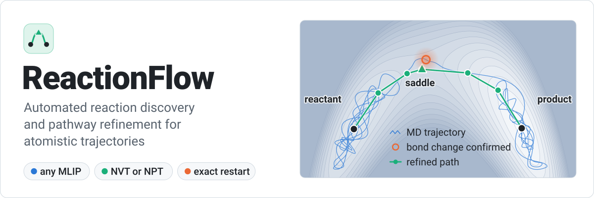
</picture>

ReactionFlow finds reactions in molecular dynamics and computes their pathways. It watches the
bonds while a trajectory runs. When a bond forms or breaks and stays that way, the trajectory
pauses at an exact checkpoint, ReactionFlow refines the minimum-energy path of that change with
NEB and climbing-image NEB, and the trajectory continues from the same state. The dynamics and the
refinement use the same machine-learned interatomic potential (MLIP), which can come from any of
ten built-in model families or from any ASE calculator.

## How it works

<picture>
  <source media="(prefers-color-scheme: dark)" srcset="docs/figures/how-it-works-dark.svg">
  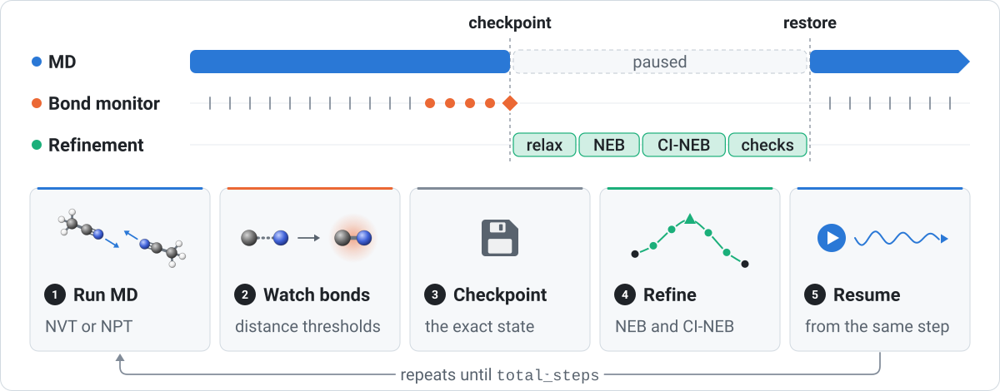
</picture>

Each trajectory runs in its own process. Every `observation_interval` MD steps, the bond monitor
compares interatomic distances with the covalent radii of each pair. A bond change is accepted
after it persists for three observations, and it becomes a reaction candidate once the new bond
topology has been stable for three observations. The trajectory then writes a checkpoint, relaxes
the reactant and product, runs NEB and CI-NEB, checks the saddle, and records the result. MD
resumes from the checkpoint, not from a relaxed structure, so it continues the trajectory that
would have run without the pause.

## Install

```bash
git clone https://github.com/Austin243/ReactionFlow.git
cd ReactionFlow
python -m pip install .
```

ReactionFlow needs Python 3.12 or newer. The core package depends only on ASE, NumPy, and
NetworkX. Model backends are separate: `reactionflow prepare campaign.json --install` installs the
ones a campaign uses, or you can install an extra yourself, for example
`python -m pip install '.[mace]'`. Several backends pin conflicting versions of e3nn, Torch, or
other packages and need separate environments ([which ones](docs/models.md#install-and-prepare)).

## Run a campaign

A campaign is one JSON file with the starting structure, the models to use, and a list of
trajectories. `reactionflow init` writes it for you after asking about the structures, models,
temperatures, pressures, and number of runs. Written by hand, a one-trajectory campaign looks like
this:

```json
{
  "schema_version": 2,
  "structure": "structure.extxyz",
  "output_root": "runs",
  "require_gpu": true,
  "adapter_profiles": {
    "mace-omol": {
      "factory": "reactionflow.adapters.mace:create_adapter",
      "options": {"family": "mp", "model": "mh-1", "head": "omol", "device": "cuda"}
    }
  },
  "reaction_run": {"observation_interval": 10},
  "trajectories": [
    {
      "id": "300K-seed1",
      "adapter_profile": "mace-omol",
      "total_steps": 100000,
      "timestep_fs": 0.5,
      "temperature_K": 300.0,
      "pressure_GPa": null,
      "seed": 1
    }
  ]
}
```

Paths are relative to the campaign file, and a trajectory can name its own `structure` in place
of the campaign-wide one. Each trajectory names one entry in `adapter_profiles`;
this one uses the MACE-MH-1 `omol` head, and any other model fits in the same place (see
[Models](#models)). With `require_gpu`, every trajectory needs exactly one visible GPU. To run on a
CPU, set it to `false` and the model's `device` to `cpu`. Anything left out of `reaction_run`
keeps its default; the [campaign guide](docs/campaigns.md) lists every field.

```bash
reactionflow init campaign.json       # write the file by answering questions
reactionflow validate campaign.json   # check the file without loading the model
reactionflow prepare campaign.json    # download the model weights
reactionflow run campaign.json        # run the trajectory
reactionflow status campaign.json     # summarize trajectories and reactions
```

A campaign with several trajectories needs `run --index N` outside Slurm. `status` only reads the
output and is safe to run while trajectories are still going. It prints one row per trajectory
and one per reaction class, with the barrier range of each class; `--json` prints the same data
for scripts.

## Models

<picture>
  <source media="(prefers-color-scheme: dark)" srcset="docs/figures/models-dark.svg">
  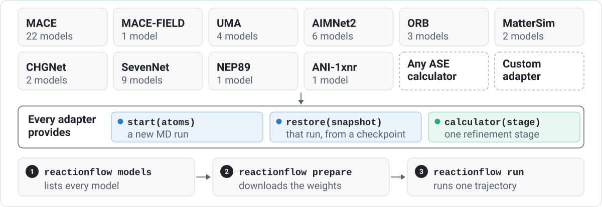
</picture>

`reactionflow models` lists every built-in model with its heads and tasks. It installs and
downloads nothing. `reactionflow prepare` downloads the weights for the models a campaign uses,
and runs then read only local files unless you pass `run --download`. On a cluster, prepare on a
node with network access. The [model guide](docs/models.md) has a profile example for every
backend.

A model that is not built in can run through the generic adapter if it has an ASE calculator:

```json
"my-model": {
  "factory": "reactionflow.adapters.ase:create_adapter",
  "options": {
    "calculator_factory": "my_package.calculators:MyCalculator",
    "calculator_kwargs": {"model_path": "/abs/path/model.pt", "device": "cuda"},
    "model_files": ["/abs/path/model.pt"]
  }
}
```

ReactionFlow calls `calculator_factory` with `calculator_kwargs` and records a hash of every file
in `model_files` in each checkpoint. The generic adapter assumes the calculator holds no state of
its own. A model with internal state or its own random numbers needs a
[custom adapter](docs/campaigns.md#write-a-custom-adapter), which implements three methods:
`start(atoms)`, `restore(snapshot)`, and `calculator(stage)`.

One campaign can mix models when they share an environment. Define one profile per model and set
`adapter_profile` on each trajectory.

## Constant volume and constant pressure

<picture>
  <source media="(prefers-color-scheme: dark)" srcset="docs/figures/ensembles-dark.svg">
  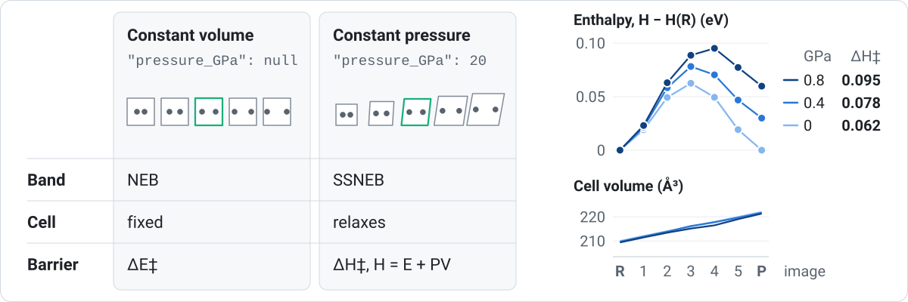
</picture>

`pressure_GPa` sets the ensemble for both MD and refinement. A number runs NPT at that pressure,
and the pathway is refined with variable-cell solid-state NEB (SSNEB). Every image then carries
its own cell and the barrier is an enthalpy, Δ(E + PV). The model must provide stress. `null` runs
NVT with ordinary NEB in the fixed cell, and the barrier is a potential energy. The chart is
SSNEB output for the volume-coupled double well in the test suite.

## Many trajectories on a cluster

<picture>
  <source media="(prefers-color-scheme: dark)" srcset="docs/figures/campaign-dark.svg">
  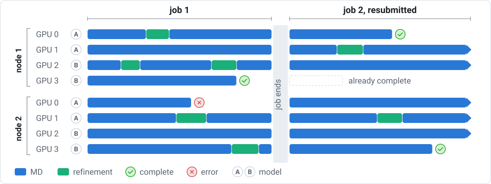
</picture>

Trajectories are independent, and a campaign grows by adding entries to `trajectories`. Under
Slurm, start one task per trajectory with one GPU each:

```bash
srun reactionflow run campaign.json
```

`SLURM_PROCID` selects the trajectory. The command stops before any MD if the number of tasks
differs from the number of trajectories. A refinement pauses only its own trajectory. An error
stops only its own trajectory and is written to `last-error.json` in that trajectory's directory.

To continue after a job ends, submit the same command again. Unfinished trajectories resume from
their last checkpoint and finished ones are left as they are. Each output directory is bound to
its structure, settings, and model, and a changed campaign is rejected instead of resumed.

[`examples/perlmutter/run-campaign.sbatch`](examples/perlmutter/run-campaign.sbatch) is a job
script for Perlmutter's four-GPU nodes. For 32 trajectories:

```bash
sbatch -A <project> --nodes=8 --ntasks=32 examples/perlmutter/run-campaign.sbatch campaign.json
```

It loads the environment that `scripts/setup-perlmutter-ani1xnr.sh` builds. For another backend,
replace its environment lines and keep the `srun` line.

## Output

<picture>
  <source media="(prefers-color-scheme: dark)" srcset="docs/figures/run-directory-dark.svg">
  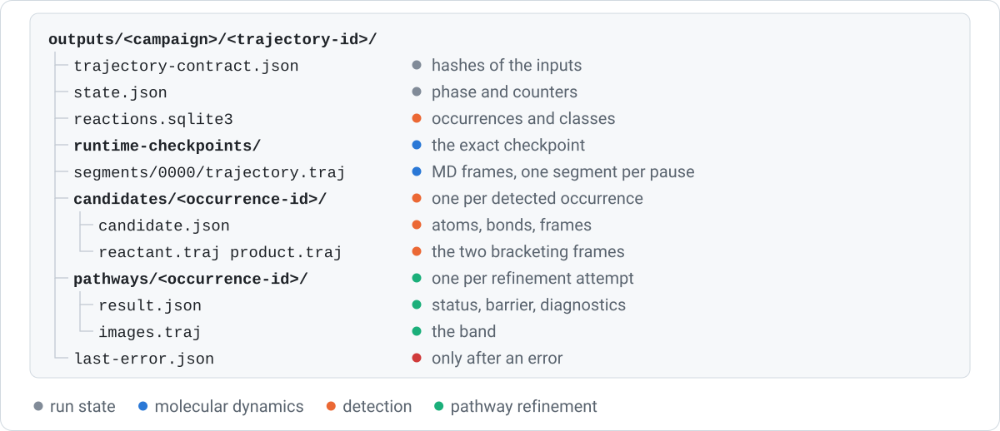
</picture>

Each trajectory writes one directory under `output_root`. Records and checkpoints are written
under a temporary name and renamed into place when complete, so an interrupted job leaves no
partial record; MD frames are appended to the segment's `trajectory.traj`. A detected occurrence and its refinement share one occurrence ID. `candidate.json` lists the
reacting atoms, the bonds before and after, and the observation frames the endpoints came from.
`result.json` holds the status, barrier, image energies, frequency check, and connectivity check,
and `images.traj` holds the band.

## Refinement outcomes

<picture>
  <source media="(prefers-color-scheme: dark)" srcset="docs/figures/outcomes-dark.svg">
  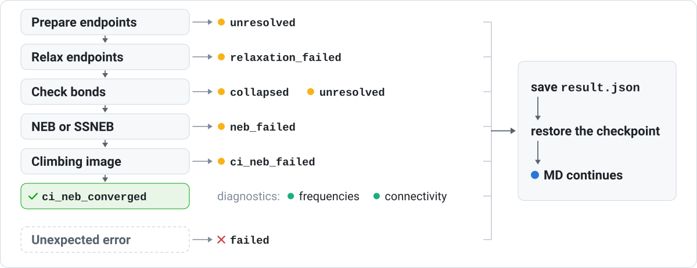
</picture>

A refinement either reaches `ci_neb_converged` or stops at the first stage that fails, with a
status that says why. `collapsed` means both endpoints relaxed to the same bond topology.
`unresolved` means the change could not be mapped onto the relaxed endpoints: a bond stayed between
the two thresholds, the change disappeared, or relaxation changed bonds elsewhere in the cell.
`failed` means an unexpected error. In every case the result is saved, the checkpoint is restored,
and MD continues. A trajectory itself stops only if it cannot save its own state.

Results are never overwritten. Every resolved occurrence is refined, including one that repeats an
earlier reaction, because the reactions that have happened around it can change its barrier. The
frequency and connectivity checks are stored with each result and do not change its status.

## Bond detection

<picture>
  <source media="(prefers-color-scheme: dark)" srcset="docs/figures/detection-dark.svg">
  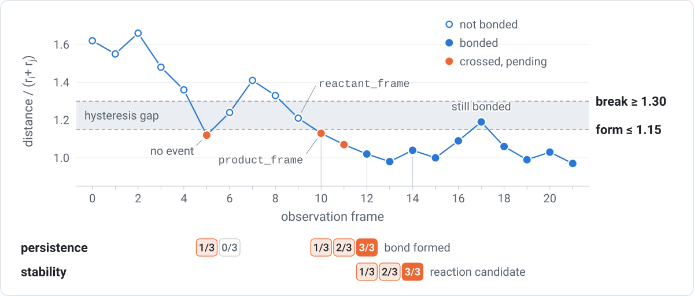
</picture>

Each pair distance is divided by the sum of the two covalent radii. A bond forms at 1.15 or less
and breaks at 1.30 or more. Between the two, the pair keeps its previous state, which stops
thermal noise from switching a bond on and off. A crossing has to hold for three consecutive
observations; the single frame below 1.15 at frame 5 does not count. The reactant and product
structures are the observations just before and just after the change (`reactant_frame` and
`product_frame`). Thresholds can be set per element pair; see
[bond detection](docs/bond-detection.md). The trace above is a prescribed C–N distance passed
through the detector and tracker with the default settings.

## Reaction classes

<picture>
  <source media="(prefers-color-scheme: dark)" srcset="docs/figures/identity-dark.svg">
  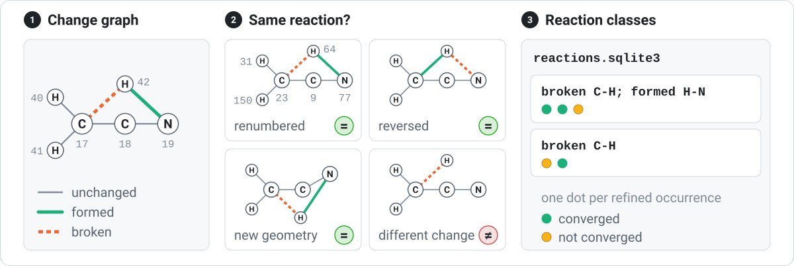
</picture>

A reaction is stored as a graph of the bonded region that contains the changed bonds. Nodes carry
the element and edges are marked unchanged, formed, or broken. Two occurrences are the same
reaction when their graphs are isomorphic, whatever the atom numbering, the geometry, or the
direction. `reactions.sqlite3` keeps every occurrence with its class, and `reactionflow status`
merges classes across trajectories that use the same model and pressure, so each class shows how
often it happened and the range of its barriers. Classes only group results; they do not decide
what is refined. See [reaction identity](docs/reaction-identity.md).

## Pathway refinement

<picture>
  <source media="(prefers-color-scheme: dark)" srcset="docs/figures/pathway-dark.svg">
  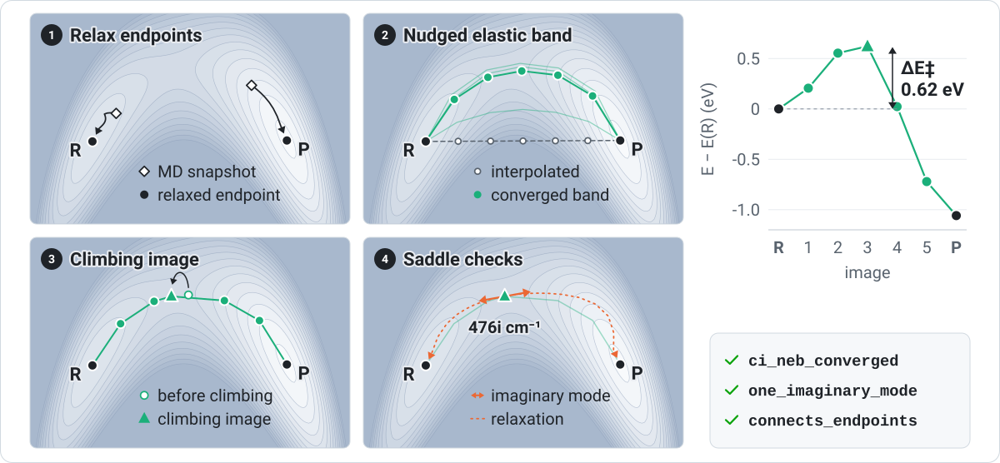
</picture>

Both MD snapshots are relaxed first, cell included at constant pressure, and checked again with
the detection thresholds. A seven-image band is interpolated between them and relaxed with NEB,
and then the highest image climbs to the saddle. A finite-difference frequency calculation over
the reacting atoms and their neighbors within 4 Å counts the imaginary modes. The saddle is then
pushed 0.1 Å each way along its mode and relaxed, which shows whether it connects the reactant
to the product. The figure is a `refine_pathway()` run with default settings on a
two-dimensional model potential; its barrier is 0.62 eV and its mode is 476i cm⁻¹. See
[pathway refinement](docs/pathway-refinement.md).

## Exact restart

<picture>
  <source media="(prefers-color-scheme: dark)" srcset="docs/figures/restart-dark.svg">
  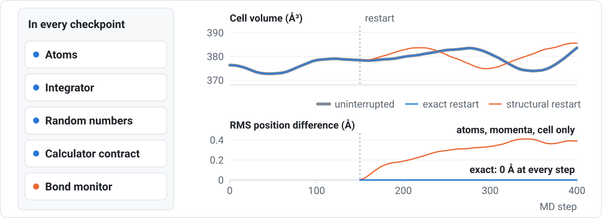
</picture>

A checkpoint holds the atoms with their momenta and cell, the integrator, thermostat, and barostat
state, the random-number generator, the model-file hashes and package versions, and the bond
monitor. The comparison above is 32 copper atoms with EMT in NPT at 600 K and 1 GPa, stopped and
restored at step 150. The restored run matches the uninterrupted one at every step. A restart from
positions, momenta, and cell alone drifts by 0.4 Å RMS within 250 steps.

A restore is refused when the model files, package versions, or adapter code differ from the
checkpoint, and the error names each difference. Run long campaigns from a release tag so the
same installation can be rebuilt. See [exact restart](docs/exact-restart.md).

## Example: acetonitrile at 20 GPa

[`examples/perlmutter/acn_20gpa_ani1xnr`](examples/perlmutter/acn_20gpa_ani1xnr/README.md) runs
four NPT trajectories of a relaxed 192-atom β-acetonitrile crystal at 20 GPa with ANI-1xnr, at
100, 300, 500, and 700 K, on one Perlmutter GPU node. From the repository root:

```bash
./scripts/setup-perlmutter-ani1xnr.sh
sbatch -A <project> -q regular examples/perlmutter/acn_20gpa_ani1xnr/submit.sbatch
```

The setup script installs ReactionFlow and its dependencies into `.perlmutter-python/` in the
checkout, downloads the ANI-1xnr weights, and validates the campaign. Results go to
`outputs/acn_20gpa_ani1xnr/`.

## Limits

A detected change is geometric: two atoms crossed a distance threshold. ReactionFlow does not
assign bond orders, compute free energies or rates, or run an IRC. The frequency check holds atoms
beyond 4 Å and the cell fixed, so one imaginary mode is consistent with a saddle but does not prove
one. The thresholds and observation interval need checking for each system.

## Documentation

- [Campaigns](docs/campaigns.md): file format, several models in one campaign, Slurm, status
- [Models](docs/models.md): every backend, its options, and its environment
- [Bond detection](docs/bond-detection.md)
- [Candidate tracking](docs/candidate-tracking.md)
- [Reaction identity](docs/reaction-identity.md)
- [Occurrence store](docs/occurrence-store.md)
- [Pathway refinement](docs/pathway-refinement.md)
- [Exact restart](docs/exact-restart.md)

## License

BSD 3-Clause; see [LICENSE](LICENSE) and [NOTICE](NOTICE).
